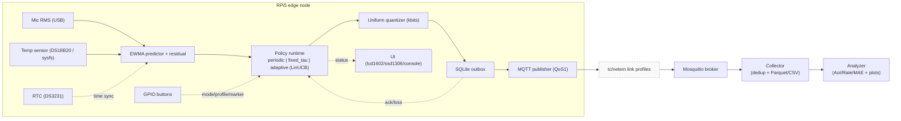
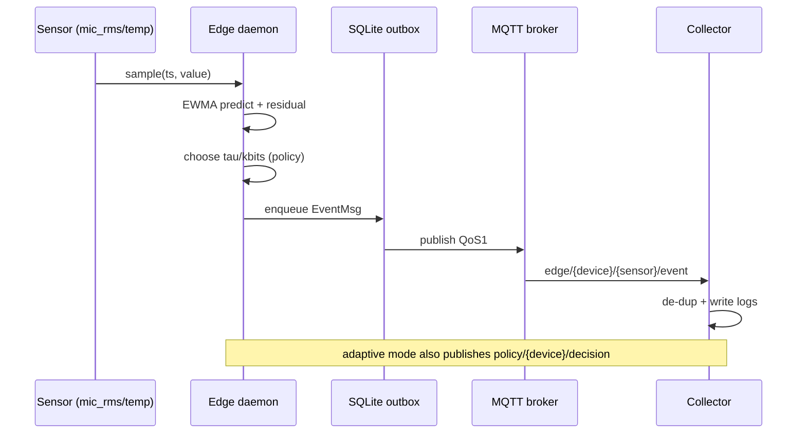

<div align="center">
  <h1>Semantic Uplink (RPi5)</h1>
  <p>AIoT semantic uplink on Raspberry Pi 5: EWMA event triggers + LinUCB policy over MQTT with tc/netem link profiles.</p>
  <p>
    <a href="https://github.com/Hmeon/semantic-uplink-rpi5/actions/workflows/ci.yaml"></a>
    
    
    <a href="edge/uploader/mqtt_publisher.py"></a>
    <a href="pyproject.toml"></a>
  </p>
  <p>
    <a href="#docs">Docs</a> &middot; <a href="#quickstart">Quickstart</a> &middot; <a href="#hardware">Hardware</a> &middot; <a href="#experiments">Experiments</a> &middot; <a href="#contributing">Contributing</a> &middot; <a href="#license">License</a>
  </p>
</div>

> [!NOTE]
> Project status: PoC (explicit in `pyproject.toml`; PoC ranges are referenced in `common/quantize.py` and `common/schema.py`).

## What It Is / Why It Matters
Semantic Uplink is an edge-to-collector pipeline that sends only meaningful sensor changes over constrained links. It uses an EWMA predictor to compute residuals, quantizes values to reduce payload size, and (in adaptive mode) uses a LinUCB contextual bandit to choose `(tau, kbits)` based on link/queue feedback.

- Problem: constrained links force a trade-off between update freshness (AoI), accuracy (MAE), and uplink rate.
- Approach: event-triggered transmission with per-event quantization and adaptive policy selection.
- Reproducible here: edge -> MQTT -> collector -> analysis pipeline plus tc/netem link profiles and experiment runners.

## Table of Contents
- [Docs](#docs)
- [Quickstart](#quickstart)
- [System Overview](#system-overview)
- [Hardware](#hardware)
- [Software](#software)
- [Configuration](#configuration)
- [Running & Development](#running--development)
- [Experiments & Evaluation](#experiments--evaluation)
- [Troubleshooting](#troubleshooting)
- [Contributing](#contributing)
- [License & Citation](#license--citation)
- [Appendix](#appendix)

<a id="docs"></a>
## Docs
| Document | Description |
| --- | --- |
| `docs/hardware.md` | Wiring diagram and pin map. |
| `docs/metrics/FIGURE_NAMING.md` | Plot naming conventions for analysis outputs. |
| `docs/metrics/LABEL_STYLE.md` | Plot label style guidelines. |

<a id="quickstart"></a>
## Quickstart

### Local dev (mock temp + console UI)
```bash
python -m venv .venv
source .venv/bin/activate
pip install -e .
```

Terminal A (broker):
```bash
mosquitto -c infra/mosquitto/mosquitto.conf
```

Terminal B (collector):
```bash
python -m collector.collector --run-dir artifacts/run1 --broker localhost --port 1883
```

Terminal C (edge, mock temp):
```bash
python -m edge.edge_daemon \
  --device-id dev1 \
  --mode periodic \
  --temp-enable --temp-backend mock \
  --ui-enable --ui-kind console \
  --broker localhost --port 1883
```

> [!NOTE]
> The broker command requires `mosquitto` in PATH (`infra/mosquitto/mosquitto.conf` is a local config).

### RPi5 stack (hardware)
```bash
python -m venv .venv
source .venv/bin/activate
pip install -e .[analysis,hw]
bash scripts/run_stack.sh
```

> [!NOTE]
> `scripts/run_stack.sh` uses tc/netem by default (`TC_ENABLE=1`); set `TC_ENABLE=0` if you do not want shaping or lack `CAP_NET_ADMIN`.

<a id="system-overview"></a>
## System Overview

### Architecture



### Dataflow



### Adaptive policy (LinUCB)
- Action space: `(tau, kbits)` arms from `configs/policy*.yaml` (required for adaptive mode).
- Context vector: `[1, aoi_norm, |res|_norm, resvar_norm, loss, qlen_norm]` where AoI includes ACK delay and `qlen_norm = log1p(q_len) / log1p(q_len_scale)` (default `q_len_scale=50`, set via `scales.q_len`; `edge/policy/linucb.py`, `edge/policy/runtime.py`).
- Reward: `r = -(w_aoi * aoi/aoi_scale + w_mae * mae/mae_scale + w_rate * rate/rate_scale)` (`edge/policy/linucb.py`).
- Update rule: per-arm ridge regression with `A <- A + x x^T`, `b <- b + r x`; selection uses `score = theta^T x + alpha_ucb * sqrt(x^T A^-1 x)` (`edge/policy/linucb.py`).
- Safety/exploration: AoI or MAE violations force a safe arm; defaults are `alpha_ucb=0.75`, `lambda_ridge=1.0`, `warmup_per_arm=1` (`edge/policy/linucb.py`).


### Quantization
- Uniform mid-tread quantizer with `kbits` in [1, 16] (`common/quantize.py`).
- Default ranges: mic_rms [-80, 0] dBFS, temp [0, 50] C (`common/quantize.py`).

### Directory map
| Path | Contents |
| --- | --- |
| `common/` | Shared schemas, metrics, JSON helpers, config validation. |
| `edge/` | Sensors, prediction, policy runtime, uploader, UI, RTC. |
| `collector/` | MQTT subscriber, de-dup, Parquet/CSV sink, analysis tools. |
| `link/` | tc/netem link shaping profiles and helpers. |
| `stack/` | Single-Pi supervisor for broker + collector + edge. |
| `experiments/` | Scenario runner for profile x mode matrices. |
| `configs/` | Device, policy, and link profile YAMLs. |
| `scripts/` | Run scripts, systemd install, benchmarks. |
| `infra/` | Mosquitto config and systemd env example. |
| `docs/` | Hardware notes, final reports, and plot conventions. |
| `tests/` | Unit and integration tests. |

<a id="hardware"></a>
## Hardware

### Bill of materials
| Part | Qty | Notes | Repo reference |
| --- | --- | --- | --- |
| Raspberry Pi 5 (8GB) | 1 | Edge node. | `docs/hardware.md` |
| DS18B20 temperature sensor | 1 | 1-Wire temp input. | `docs/hardware.md`, `edge/sensors/temp.py` |
| USB mic + USB soundcard | 1 | RMS dBFS input. | `docs/hardware.md`, `edge/sensors/mic_rms.py` |
| 1602 LCD + PCF8574 backpack | 1 | I2C status display (0x27 / 0x3F). | `docs/hardware.md`, `edge/ui/lcd.py` |
| Momentary buttons (MODE/LINK/MARKER) | 3 | GPIO active-low with pull-ups. | `docs/hardware.md`, `edge/ui/buttons.py` |
| 4.7k pull-up resistor | 1 | DS18B20 data line. | `docs/hardware.md` |
| DS3231 RTC (optional) | 1 | I2C RTC at 0x68. | `docs/hardware.md`, `edge/rtc/ds3231.py` |
| Buzzer (optional) | 1 | GPIO18, active-high. | `docs/hardware.md` |

### Wiring / pin map (BCM)
| Signal | RPi pin | Device | Notes |
| --- | --- | --- | --- |
| I2C1 SDA | 3 (BCM2) | LCD backpack | `0x27` default, `0x3F` fallback. |
| I2C1 SCL | 5 (BCM3) | LCD backpack | I2C bus 1. |
| 1-Wire data | 7 (BCM4) | DS18B20 | 4.7k pull-up to 3V3. |
| Button MODE | 11 (BCM17) | GPIO button | Internal pull-up, active-low. |
| Button LINK | 13 (BCM27) | GPIO button | Internal pull-up, active-low. |
| Button MARKER | 15 (BCM22) | GPIO button | Internal pull-up, active-low. |
| Buzzer (opt) | 12 (BCM18) | Buzzer | Active-high to GND. |
| USB | USB-A | Mic/Soundcard | RMS dBFS input. |

### RPi prerequisites
- Enable 1-Wire: `dtoverlay=w1-gpio,gpiopin=4` (`docs/hardware.md`).
- Enable I2C (`i2c_arm`) and verify `/dev/i2c-1` (`docs/hardware.md`).
- Buttons use internal pull-ups; wire to ground for active-low presses.

> [!WARNING]
> Audio privacy: the mic pipeline computes RMS dBFS only; raw audio is never stored or transmitted (`edge/sensors/mic_rms.py`).

> [!NOTE]
> `lora_sf10` and `lora_sf12` are tc/netem profiles (IP-level approximation only), not LoRaWAN simulations (`link/shaper/tc_profiles.py`).

<a id="software"></a>
## Software

### Runtime requirements
| Component | Requirement | Evidence |
| --- | --- | --- |
| Python | >= 3.10 | `pyproject.toml` |
| MQTT broker | Mosquitto binary in PATH | `stack/pi_stack.py`, `infra/mosquitto/mosquitto.conf` |
| tc/netem | Linux + `CAP_NET_ADMIN` (or root) | `link/shaper/tc_profiles.py` |

### Install
```bash
python -m venv .venv
source .venv/bin/activate
pip install -e .
```

Optional extras from `pyproject.toml`:
| Extra | Adds | Used by |
| --- | --- | --- |
| `analysis` | matplotlib | `collector/analyze.py` plots |
| `hw` | smbus2, gpiozero, rpi-lgpio | `edge/ui/lcd.py`, `edge/ui/buttons.py`, `edge/rtc/ds3231.py` |
| `dev` | pytest, ruff | `.github/workflows/ci.yaml`, `scripts/health_check.sh` |

Alternative (non-editable) install:
```bash
pip install -r requirements.txt
```

<a id="configuration"></a>
## Configuration
Key config files:
| File | Purpose | Used by |
| --- | --- | --- |
| `configs/device.yaml` | Device id, sensors, UI, MQTT defaults. | `edge/edge_daemon.py`, `experiments/run_scenarios.py` |
| `configs/policy.yaml` | Adaptive arms + reward + safety. | `edge/edge_daemon.py`, `collector/analyze.py` |
| `configs/policy_adaptive_*.yaml` | Policy presets (AIoT, quality, etc.). | `edge/edge_daemon.py`, `scripts/run_3h_sequence.sh` |
| `configs/policy_poc_covforce_kpi.yaml` | KPI-oriented preset (coverage liveness + payload-fair + decision diagnostics). | `scripts/run_3h_sequence.sh`, `collector/analyze.py` |
| `configs/link_profiles.yaml` | tc/netem profiles. | `link/shaper/tc_profiles.py`, `stack/pi_stack.py`, `experiments/run_scenarios.py` |
| `infra/systemd/semantic-uplink-stack.env.example` | Env overrides for `scripts/run_stack.sh`. | `scripts/run_stack.sh` |

Example policy YAML (`configs/policy.yaml`):
```yaml
arms:
  - { tau: 1.5, kbits: 6 }
  - { tau: 3.0, kbits: 8 }
  - { tau: 6.0, kbits: 10 }
reward:
  alpha: 1.0
  beta: 1.0
  gamma: 0.5
safety:
  aoi_max_ms: 5000
  mae_max: 2.0
```

> [!NOTE]
> `tau` in `policy.yaml` is **not a time interval (seconds)**. In this project it is an EWMA **residual threshold in sensor units**:
> - `mic_rms`: dBFS units (e.g., 1.5, 3.0, …)
> - `temp`: °C units (e.g., 0.1, 0.2, …)

Example device YAML (`configs/device.yaml`):
```yaml
device_id: rpi5a
sensors:
  mic:
    frame_ms: 100
    samplerate: 16000
  temp:
    period_hz: 1
ui:
  enabled: true
  backend: "lcd"
mqtt:
  host: localhost
  port: 1883
  base_topic: edge
  # Optional auth/TLS (recommended if exposing broker beyond localhost)
  # username: "user"
  # password: "pass"
  # tls: false
  # cafile: "/etc/ssl/certs/ca-certificates.crt"
  # certfile: "/path/to/client.crt"
  # keyfile: "/path/to/client.key"
```

Environment variables used in scripts:
- `SEMUP_SEED` sets the edge RNG seed (`edge/edge_daemon.py`).
- `RUN_DIR`, `DEVICE_CONFIG`, `POLICY_ARMS`, `BROKER_HOST`, `BROKER_PORT`, `BASE_TOPIC`,
  `MQTT_USERNAME`, `MQTT_PASSWORD`, `MQTT_TLS`, `MOSQUITTO_LISTEN_HOST`, `TC_IFACE`
  (see `infra/systemd/semantic-uplink-stack.env.example`).

> [!IMPORTANT]
> Analyzer webhooks (`collector/analyze.py --discord-webhook`) should be provided via secrets or local env files. Do not commit real URLs or tokens.

<a id="running--development"></a>
## Running & Development
| Task | Command |
| --- | --- |
| Edge daemon (full device) | `python -m edge.edge_daemon --device-id rpi5-01 --profile slow_10kbps --mode adaptive --run-dir artifacts/run_rpi5 --device-config configs/device.yaml --arms configs/policy_poc_covforce_kpi.yaml --decision-publish event` |
| Collector | `python -m collector.collector --run-dir artifacts/run1 --broker localhost --port 1883 --base-topic edge` |
| Analyze | `python -m collector.analyze --input artifacts/run1/logs --out results/run1 --diagnostic-plots --audit` |
| Single-Pi stack | `bash scripts/run_stack.sh` |
| Apply tc profile | `sudo python -m link.shaper.tc_profiles apply --iface lo --profile slow_10kbps` |
| Scenario runner | `python -m experiments.run_scenarios --run-root artifacts/experiments --profiles slow_10kbps --modes periodic,fixed_tau,adaptive --no-mic --temp --with-collector` |
| Policy benchmark | `python scripts/bench_policy_rpi5.py --steps 2000 --out artifacts/bench_policy_rpi5.csv` |

Dev checks:
```bash
ruff check .
pytest -q
```

You can also run `bash scripts/health_check.sh` for a combined pass.

<a id="experiments"></a>
## Experiments & Evaluation

### Metrics (as implemented)
| Metric | Definition | Where |
| --- | --- | --- |
| Rate (B/s) | MQTT v3.1.1 publish size (topic + payload) aggregated over receiver time. | `collector/analyze.py`, `common/mqttutil.py` |
| AoI mean / p95 (ms) | Age of Information from `t_recv_ns`; falls back to inter-event gaps. | `collector/analyze.py`, `common/metrics.py` |
| MAE_event mean / p95 | Mean absolute residual `abs(res)` on events only. | `collector/analyze.py` |

> [!NOTE]
> MAE is event-based (residual at emit time), not full-signal MAE.

### Reproduce scenarios (matrix runner)
```bash
python -m experiments.run_scenarios \
  --run-root artifacts/experiments \
  --profiles slow_10kbps \
  --modes periodic,fixed_tau,adaptive \
  --no-mic --temp --with-collector
```

Outputs are stored under `artifacts/experiments/<timestamp>_<device_id>` with `plan.json` and `run_meta.json` (`experiments/run_scenarios.py`).

### Field measurement (single RPi5): 3-policy 3-hour sequence (recommended)
`scripts/run_3h_sequence.sh` runs **on a single RPi5** and executes: `periodic → fixed_tau → adaptive` (each 3h).
- Recommended setup is broker/collector/edge on the same host for stable `t_recv_ns`-based AoI.
- The script writes `CHECKLIST.md`, `RUN_META.txt`, and a `sequence.log` for reproducibility.
- It runs `collector.analyze` at the end and writes `results/field_runs/<run_root>/kpi_verdict.json`.

Preflight (quick list):
- (required) Packages: `mosquitto`, `mosquitto-clients`, `alsa-utils`, `coreutils` (for `timeout`), `python3-venv`
- (required) Broker running: `mosquitto -c infra/mosquitto/mosquitto.conf` (or keep mosquitto running via systemd)
- (recommended) Time sync: `timedatectl status` shows `System clock synchronized: yes` (script may temporarily stop NTP)
- (sensor) DS18B20: verify `ls /sys/bus/w1/devices/28-*/w1_slave` (override via `W1_PATH` if needed; wiring/overlay: see `docs/hardware.md`)
- (sensor) Mic: use `arecord -l` then set `MIC_DEVICE=hw:2,0` (example)
- (tc/netem) Shaping requires root or `CAP_NET_ADMIN` when `TC_ENABLE=1`; set `TC_ENABLE=0` to skip shaping / measure the real link

Install example (Raspberry Pi OS / Debian):
```bash
sudo apt-get update
sudo apt-get install -y mosquitto mosquitto-clients alsa-utils i2c-tools coreutils python3-venv
python3 -m venv .venv && source .venv/bin/activate
pip install -e .[analysis,hw]
```

Quick smoke test (recommended): before the full 9h run (3h × 3 policies), validate the stack with 2min × 3 policies.
```bash
RUN_SECONDS=120 KPI_ENFORCE_PASS=0 FIELD_LABEL=SMOKE \
  ADAPTIVE_ARMS=configs/policy_poc_covforce_kpi.yaml \
  PYTHON=$HOME/.venv/bin/python bash scripts/run_3h_sequence.sh
```

```bash
# Field A
FIELD_LABEL=A SEMUP_SEED=0 DEVICE_ID=rpi5a \
  ADAPTIVE_ARMS=configs/policy_poc_covforce_kpi.yaml \
  DECISION_PUBLISH=event \
  ANALYZE_EXTRA_ARGS="--diagnostic-plots --ucb-timeseries --pareto-p95 --save-parquet" \
  PYTHON=$HOME/.venv/bin/python bash scripts/run_3h_sequence.sh

# Field B (same settings)
FIELD_LABEL=B SEMUP_SEED=0 DEVICE_ID=rpi5a \
  ADAPTIVE_ARMS=configs/policy_poc_covforce_kpi.yaml \
  DECISION_PUBLISH=event \
  ANALYZE_EXTRA_ARGS="--diagnostic-plots --ucb-timeseries --pareto-p95 --save-parquet" \
  PYTHON=$HOME/.venv/bin/python bash scripts/run_3h_sequence.sh
```

Outputs:
- run root: `artifacts/field_runs/<run_root>/`
- results: `results/field_runs/<run_root>/kpi_verdict.json`

(Recommended) Archive the run (for backup/sharing):
```bash
tar -czf "field_run_<run_root>.tar.gz" "artifacts/field_runs/<run_root>" "results/field_runs/<run_root>"
```

See `scripts/run_3h_sequence.sh` for environment variables (e.g., `W1_PATH`, `MIC_DEVICE`, `PROFILE`, `IFACE`, `TC_ENABLE`, `ADAPTIVE_ARMS`, `DECISION_PUBLISH`, `RUN_ROOT_DIR`, `ANALYZE_EXTRA_ARGS`).

### Analyze logs (re-run / analyze-only)
```bash
ANALYZE_ONLY=1 RUN_ROOT_DIR=artifacts/field_runs/<run_root> \
  PYTHON=$HOME/.venv/bin/python bash scripts/run_3h_sequence.sh
```

### Compare Scenario A/B results
```bash
python scripts/compare_field_results.py \
  --results-a results/field_runs/<run_root_A> \
  --results-b results/field_runs/<run_root_B>
```

KPI (strict PASS/FAIL):
- `collector.analyze` emits `kpi_final.csv` (K1..K5 + overall per profile × sensor) and `kpi_verdict.json` (project PASS/FAIL).
- KPI definition: see the KPI verdict logic in `collector/analyze.py`.

<a id="troubleshooting"></a>
## Troubleshooting
<details>
<summary>Common issues</summary>

- `arecord` missing: the mic backend falls back to arecord when sounddevice is unavailable; install `alsa-utils` or use `--mic-backend sounddevice` (`edge/sensors/mic_rms.py`).
- Parquet not written: if `pyarrow` is missing, the collector falls back to CSV (`collector/collector.py`).
- LinUCB/pipeline diagnostics empty: decision-based diagnostics are skipped if `decisions_*.parquet` is missing. Enable decision logging with `--decision-publish event` (or `DECISION_PUBLISH=event`) and set `diagnostics.enabled: true` in the active policy YAML (for payload-fair rate comparisons, prefer `diagnostics.events_enabled: false`).
- LCD/RTC not found: install `.[hw]` or disable UI/RTC (`edge/ui/lcd.py`, `edge/rtc/ds3231.py`).
- Buttons disabled: `gpiozero` missing or GPIO unavailable; install `.[hw]` or `--buttons-disable` (`edge/ui/buttons.py`).
- tc/netem apply fails: requires root or `CAP_NET_ADMIN`; disable with `--tc-disable` or `TC_ENABLE=0` (`link/shaper/tc_profiles.py`).
- DS18B20 not detected: set `--temp-backend sysfs`/`mock` or verify `/sys/bus/w1/devices/28-*/w1_slave` (`edge/sensors/temp.py`, `scripts/run_3h_sequence.sh`).
- Broker connection errors: ensure mosquitto is running or let the stack auto-start it (`stack/pi_stack.py`).
- AoI spikes: system time jumps; consider RTC or NTP stabilization (`edge/rtc/ds3231.py`, `scripts/run_3h_sequence.sh`).

</details>

<a id="contributing"></a>
## Contributing
- Contribution guide: see `CONTRIBUTING.md`.
- Style: `ruff check` (see `.github/workflows/ci.yaml`).
- Tests: `python -m pytest -q` (see `.github/workflows/ci.yaml` and `scripts/health_check.sh`).
- Hardware changes: update `docs/hardware.md` and CLI defaults in `edge/edge_daemon.py`.

PR checklist:
- [ ] Tests and lint pass locally.
- [ ] Config/schema changes are validated (`common/config.py`).
- [ ] Hardware pin/address changes documented (`docs/hardware.md`).

<a id="license"></a>
## License & Citation
- License: Apache-2.0 (`LICENSE`)
- Citation: see `CITATION.cff`.

<a id="appendix"></a>
## Appendix

### Glossary
| Term | Meaning in this repo |
| --- | --- |
| AoI | Age of Information computed from receiver time (`t_recv_ns`) when available. |
| EWMA | Exponentially weighted moving average predictor for residuals. |
| LinUCB | Contextual bandit that selects `(tau, kbits)` per sample. |
| Outbox | SQLite WAL queue that stores MQTT publishes until PUBACK. |
| QoS1 | MQTT publish level used for edge events (dedup in collector). |
