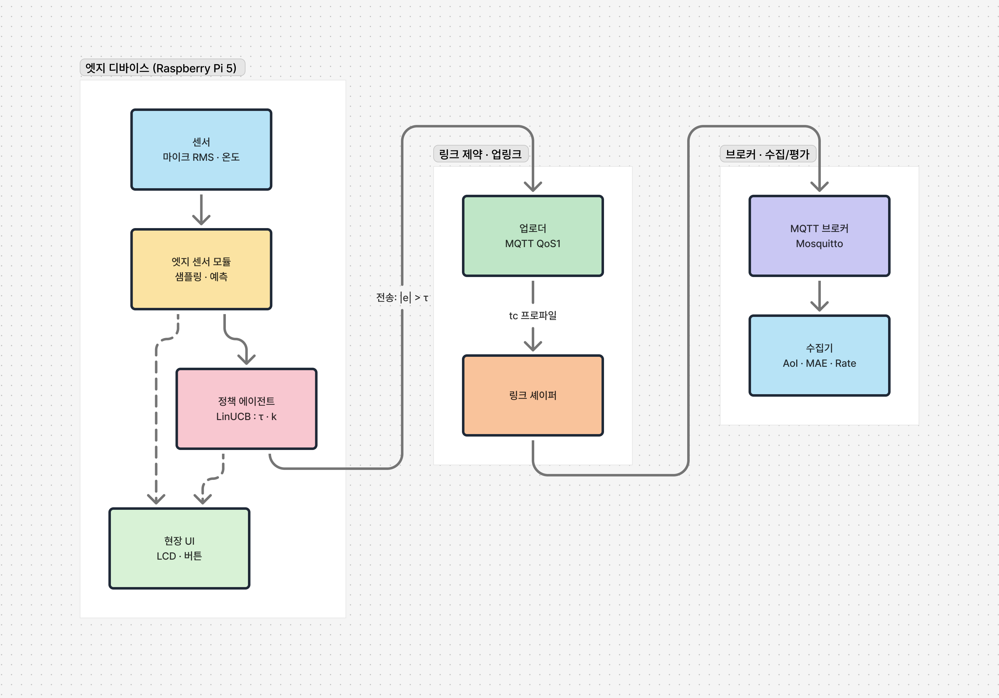
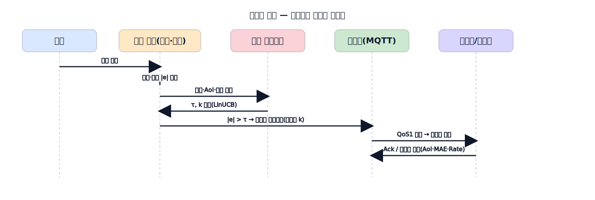
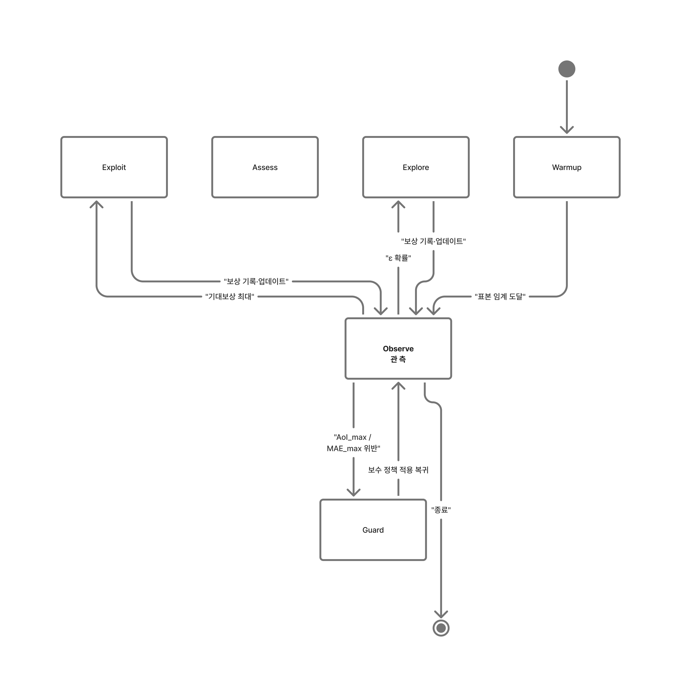
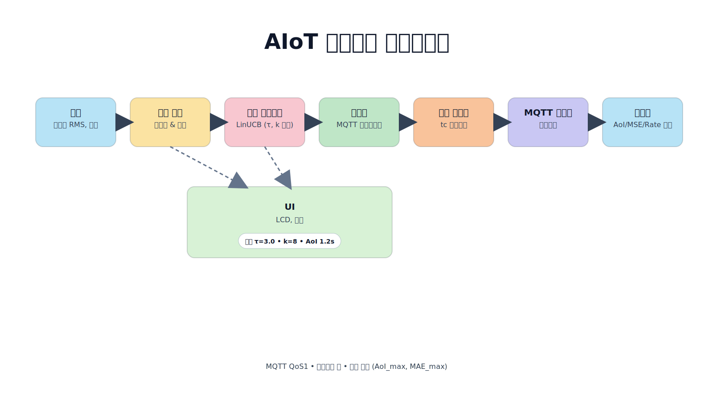

# AIoT 의미전송 통신 PoC · Raspberry Pi 5  
**AI‑Driven Semantic Uplink for Low‑Bandwidth IoT**


> **KR** · 저속·불안정 링크(LoRa 급 제약 가정)에서 **필요한 순간·필요한 정보만** 보내도록, 엣지 AI가 전송 정책(**임계값 τ**, **양자화 k**)을 스스로 조절하는 **의미전송(Semantic Uplink)** 프로젝트입니다.  
> **EN** · An edge‑intelligent **semantic uplink** that adapts **threshold (τ)** and **quantization (k)** to send **only information that matters** over low/unstable links.

---

## 목차 · Table of Contents
- [개요 · Overview](#개요--overview)
- [아키텍처 · Architecture](#아키텍처--architecture)
- [데이터 흐름 · Data Flow](#데이터-흐름--data-flow)
- [정책 상태도(LinUCB) · Policy (LinUCB)](#정책-상태도linucb--policy-linucb)
- [핵심 지표 · Key Metrics](#핵심-지표--key-metrics)
- [빠른 시작 · Quick Start](#빠른-시작--quick-start)
- [실행 순서 · Run Order](#실행-순서--run-order)
- [설정 · Configuration](#설정--configuration)
- [데이터 모델 · Data Model](#데이터-모델--data-model)
- [폴더 구조 · Repository Layout](#폴더-구조--repository-layout)
- [로드맵(7주) · 7‑week Roadmap](#로드맵7주--7week-roadmap)
- [품질 게이트 · Quality Gates](#품질-게이트--quality-gates)
- [보안 · 개인정보 · Security & Privacy](#보안--개인정보--security--privacy)
- [기여 · Contributing](#기여--contributing)
- [라이선스 · License](#라이선스--license)
- [English Version](#english-version)
- [부록 · Appendix](#부록--appendix)

---

## 개요 · Overview
- **문제**: 주기 전송은 저속/손실 링크에서 **불필요한 트래픽**과 **신선도 저하(AoI↑)** 를 초래합니다.  
- **핵심 아이디어**: 엣지에서 **예측값 대비 잔차** |e|가 **임계값 τ**를 넘을 때만 전송(이벤트 트리거, SoD). 링크 상태를 반영해 **양자화 비트수 k**를 가변 적용.  
- **신뢰성**: MQTT **QoS1 + Outbox(오프라인 큐) + 백오프**로 **끊김 복구**와 **중복 허용**을 조합.  
- **목표**: 전송량 **≥ 60% 절감**, AoI **≥ 30% 개선**, MAE 증가는 **≤ 10%**로 제한.

> We reduce traffic without sacrificing usefulness by sending **only deviations that matter**, while keeping **freshness (AoI)** high and **error (MAE)** bounded.

---

## 아키텍처 · Architecture
> 센서 → 엣지(예측·정책) → 업로더(MQTT) → **링크 제약(tc)** → 브로커 → 수집/평가

<p align="center">
  
</p>

**구성요소**
- **Sensors**: 마이크 RMS, 온도  
- **Edge**: 예측기(EWMA/AR1) → 잔차 → 정책(LinUCB) → 양자화 → 업로더  
- **Shaper**: `tc/netem/tbf`로 10 kbps·지연·손실 등 가혹한 링크를 에뮬  
- **Broker/Collector**: Mosquitto, 수집/복원, AoI·MAE·Rate 계산  
- **UI**: LCD/버튼으로 정책·지표 확인 및 간단 제어

---

## 데이터 흐름 · Data Flow
> |e| > τ일 때만 **이벤트** 전송. 브로커 **Ack** 후 Outbox 정리.

<p align="center">
  
</p>

1) **Sampling** → 2) **Predict & Residual** → 3) **Policy(τ,k)** → 4) **Quantize** → 5) **MQTT QoS1**  
오프라인 시 **Outbox 큐**에 보관, 재연결 시 백오프로 **안전 재전송**.

---

## 정책 상태도(LinUCB) · Policy (LinUCB)
> 컨텍스트 밴딧으로 (τ, k) 조합 선택 · **가드레일(AoI_max, MAE_max)** 보장

<p align="center">
  
</p>

- **Observe → Explore/Exploit** 루프, 보상 r = −(α·AoI + β·MAE + γ·Rate)  
- **Guardrail** 위반 시 즉시 보수 정책(τ↓ 또는 k↑)으로 전환

---

## 핵심 지표 · Key Metrics
- **Rate**: 브로커 수신 **바이트/초** (Network usage)  
- **AoI (Age of Information)**: 수신자가 들고 있는 **최신 정보의 나이**  
- **MAE**: 복원값 vs. 원본 평균 절대 오차  
🎯 **목표**: **Rate↓** 크게, **AoI↓** 의미 있게, **MAE↑**는 허용 임계 내

---

## 빠른 시작 · Quick Start

```bash
# OS & 필수 패키지
sudo apt update && sudo apt full-upgrade -y
sudo apt install -y mosquitto mosquitto-clients iproute2 python3-venv python3-dev build-essential libportaudio2

# 파이썬 가상환경
python3 -m venv .venv && source .venv/bin/activate
pip install -r requirements.txt

# 브로커 실행(개발용)
sudo systemctl enable mosquitto && sudo systemctl start mosquitto
실행 순서 · Run Order
bash
코드 복사
# 1) 링크 프로파일 적용 (예: 저속 10kbps)
python -m link.shaper.tc_profiles apply lo slow_10kbps

# 2) 수집기(브로커 구독 → 지표 계산/저장)
python -m collector.collector

# 3) 엣지 (모드별 시나리오)
#   3-1) 주기 전송(기준선)
python -m edge.edge_daemon --mode periodic
#   3-2) 고정 임계 ETS
python -m edge.edge_daemon --mode fixed --tau_mic 3.0 --tau_temp 0.2
#   3-3) LinUCB 적응 정책
python -m edge.edge_daemon --mode adaptive --arms configs/policy.yaml

# 4) 결과 집계/시각화
python -m collector.analyze --input data/ --out results/
설정 · Configuration
configs/의 YAML만 바꿔도 실험 조건이 바뀝니다(재현성↑).

configs/device.yaml

yaml
코드 복사
device_id: rpi5a
sensors:
  mic:  { frame_ms: 100, samplerate: 16000, normalize: true }
  temp: { period_hz: 1 }
ui:    { enabled: true, backend: "lcd" }  # lcd | console
mqtt:  { host: localhost, port: 1883, base_topic: "edge" }
configs/policy.yaml

yaml
코드 복사
arms:
  - { tau: 1.5, kbits: 6 }
  - { tau: 3.0, kbits: 8 }
  - { tau: 6.0, kbits: 10 }
reward:  { alpha: 1.0, beta: 1.0, gamma: 0.5 }  # AoI, MAE, Rate 가중
safety:  { aoi_max_ms: 5000, mae_max: 2.0 }
configs/link_profiles.yaml

yaml
코드 복사
profiles:
  slow_10kbps: { tbf: "tbf rate 10kbit burst 4kbit limit 4k",  netem: "netem delay 300ms loss 3%" }
  delay_loss:  { tbf: "tbf rate 100kbit burst 16kbit limit 32k", netem: "netem delay 500ms loss 8% reorder 10%" }
  cellular_var:{ tbf: "tbf rate 200kbit burst 32kbit limit 64k", netem: "netem delay 120ms loss 2%" }
데이터 모델 · Data Model
Event (예시)

json
코드 복사
{
  "ts": "2025-11-03T10:21:34.512Z",
  "seq": 10231,
  "device_id": "rpi5a",
  "sensor": "mic",
  "val": -42.1,
  "pred": -43.3,
  "res": 1.2,
  "tau": 3.0,
  "kbits": 8,
  "aoi_ms": 1200,
  "profile": "slow_10kbps",
  "policy": "linucb#5"
}
PolicyDecision (예시)

json
코드 복사
{
  "ts": "2025-11-03T10:21:34.480Z",
  "device_id": "rpi5a",
  "state_aoi": 1.2,
  "state_res": 1.2,
  "state_res_var": 0.6,
  "state_loss": 0.03,
  "state_q_len": 5,
  "tau": 3.0,
  "kbits": 8,
  "reward": -1.42
}
폴더 구조 · Repository Layout
bash
코드 복사
common/          # 스키마·양자화·시간/MQTT 유틸
edge/            # 센서→예측→정책→업로더→UI
collector/       # 브로커 구독→지표 계산/저장
link/            # tc 기반 링크 셰이퍼
experiments/     # 자동실험 스크립트
configs/         # device/policy/link 설정
docs/figma/      # (이 README가 임베드한) 다이어그램
data/, logs/     # 실험 산출물
.github/         # CI 워크플로
로드맵(7주) · 7‑week Roadmap
W1: 지표·프로파일 동결 / 수집기 파이프 완료

W2: 기준선(주기 전송) 수집 / AoI·MAE·Rate 대시보드

W3: 고정 τ ETS / 1차 리포트

W4–W5: LinUCB 구현·튜닝 / 안전가드 검증

W6: 반복 실험 / 파레토 곡선

W7: UI 통합 / 최종 보고·데모

품질 게이트 · Quality Gates
 토픽/스키마 필수 필드 누락 0

 QoS1 중복 수신 처리(SEQ de‑dup)

 Outbox 오프라인→복구 유실 0

 프로파일 3종 × 모드 3종 반복 ≥ 3회

 지표: 평균·P95 AoI, 평균 MAE, 평균 바이트/초

 파레토 곡선 + 표(주기 vs 고정τ vs 적응)

 README/다이어그램/스크립트 동기화

보안 · 개인정보 · Security & Privacy
Transport: TLS(옵션), 인증(계정·토큰) 권장

MQTT: QoS1/지속세션/Retain 조합 시 중복 가능성 고려

Audio: 원음 미보관·미전송, RMS 통계만 사용

Data at Rest: 로컬 Outbox/로그 암호화(선택), 접근권한 최소화

기여 · Contributing
bash
코드 복사
pip install -e .[dev]
ruff . && pytest -q
브랜치: feat/*, fix/*, chore/*

커밋: type(scope): subject (예: feat(edge): add AR(1) predictor)

라이선스 · License
TBD (추후 지정)

English Version
Overview
Problem · Periodic transmissions waste bandwidth on low/unstable links and degrade freshness (AoI).

Idea · At the edge, transmit an event only when the residual |e| exceeds a threshold τ, and adapt quantization bits k to link conditions.

Reliability · Combine MQTT QoS1, Outbox (offline queue), and backoff to handle disconnections and duplicates.

Goal · ≥ 60% traffic reduction, ≥ 30% AoI improvement, ≤ 10% MAE penalty.

Architecture
<p align="center">  </p>
Data Flow
<p align="center">  </p>
Policy (LinUCB)
<p align="center">  </p>
Key Metrics
Rate (bytes/sec at broker), AoI, MAE
Target: Rate↓, AoI↓, MAE↑ bounded

Quick Start
bash
코드 복사
sudo apt update && sudo apt full-upgrade -y
sudo apt install -y mosquitto mosquitto-clients iproute2 python3-venv python3-dev build-essential libportaudio2
python3 -m venv .venv && source .venv/bin/activate
pip install -r requirements.txt
sudo systemctl enable mosquitto && sudo systemctl start mosquitto
Run Order
bash
코드 복사
python -m link.shaper.tc_profiles apply lo slow_10kbps
python -m collector.collector
python -m edge.edge_daemon --mode periodic
python -m edge.edge_daemon --mode fixed --tau_mic 3.0 --tau_temp 0.2
python -m edge.edge_daemon --mode adaptive --arms configs/policy.yaml
python -m collector.analyze --input data/ --out results/
Configuration
See configs/ YAML files to change experiment settings without touching code.

Repository Layout
bash
코드 복사
common/  edge/  collector/  link/  experiments/  configs/  docs/figma/  data/  logs/  .github/
7‑week Roadmap
W1: Metrics/profiles freeze; collector pipeline

W2: Baseline (periodic) & dashboard

W3: Fixed‑τ ETS; report v1

W4–W5: LinUCB & guardrail tests

W6: Repeats & Pareto

W7: UI integration & demo

Quality Gates
Topic/schema validations; QoS1 de‑dup; outbox recovery (0 loss)

3 profiles × 3 modes × ≥3 runs; AoI (mean/P95), MAE, Rate summary

Pareto chart & table; README/diagrams/scripts in sync

Contributing
bash
코드 복사
pip install -e .[dev]
ruff . && pytest -q
License
TBD

부록 · Appendix
Pipeline Diagram (Optional)

<p align="center">  </p>
makefile
코드 복사
::contentReference[oaicite:0]{index=0}