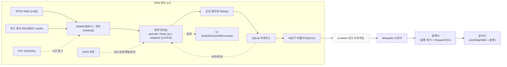
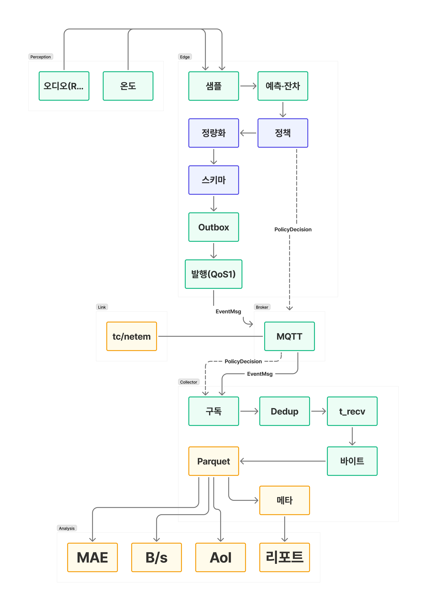
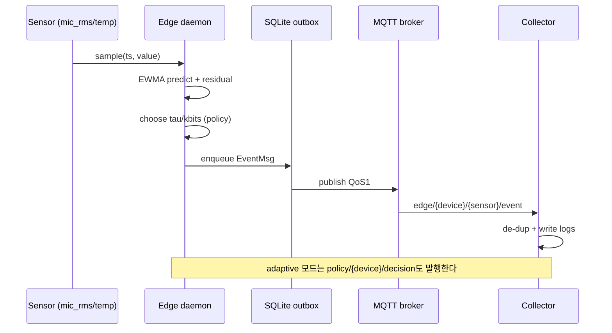
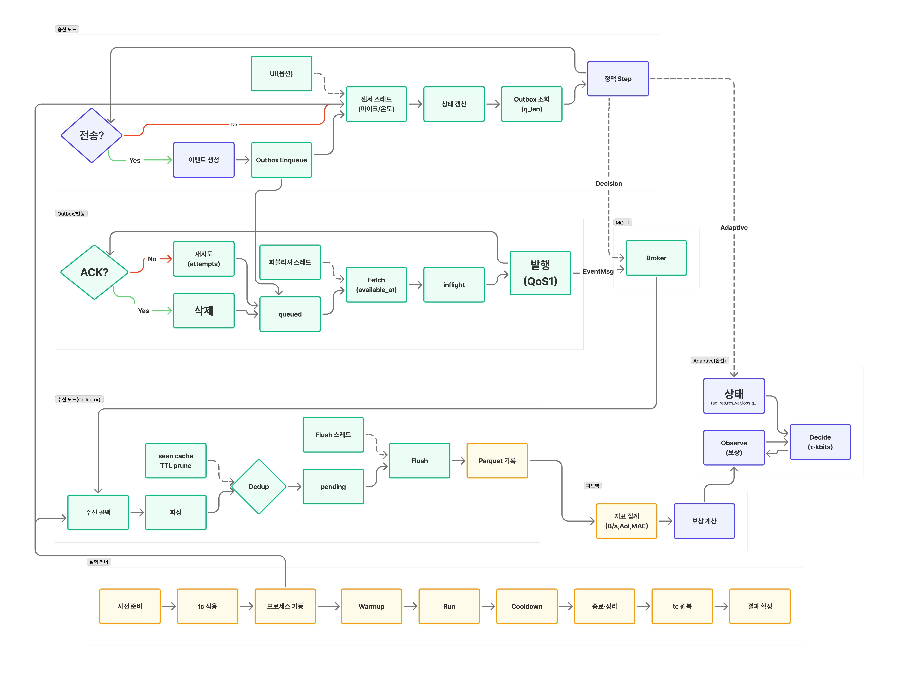
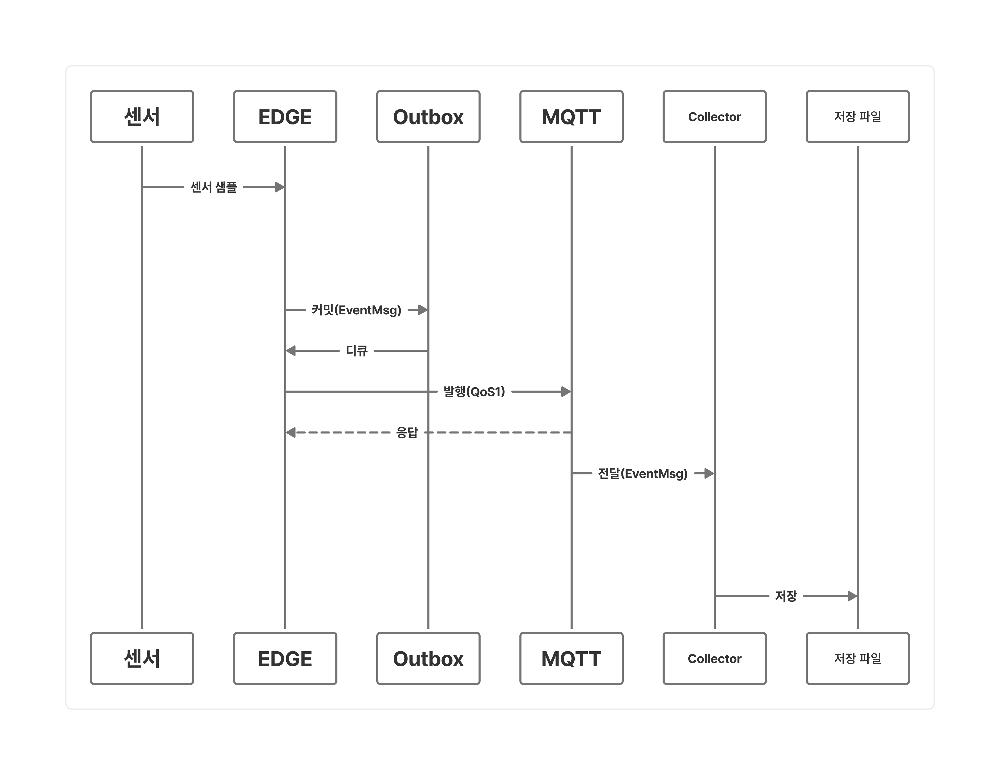
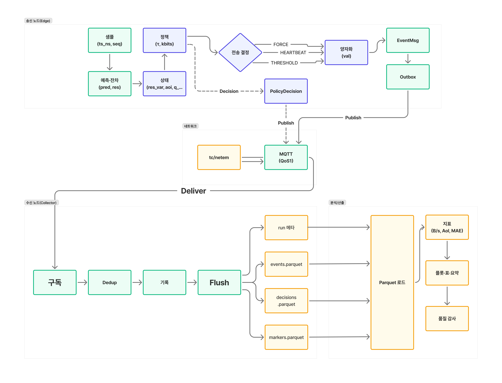

<div align="center">
  <h1>Semantic Uplink (RPi5)</h1>
  <p>Raspberry Pi 5 기반 AIoT 시맨틱 업링크: EWMA 이벤트 트리거 + MQTT 상의 LinUCB 정책, 그리고 tc/netem 링크 프로파일.</p>
  <p>
    <a href="https://github.com/Hmeon/semantic-uplink-rpi5/actions/workflows/ci.yaml"></a>
    
    
    <a href="edge/uploader/mqtt_publisher.py"></a>
    <a href="pyproject.toml"></a>
  </p>
  <p>
    <a href="#docs">문서</a> &middot; <a href="#quickstart">빠른 시작</a> &middot; <a href="#system-overview">시스템 개요</a> &middot; <a href="#hardware">하드웨어</a> &middot; <a href="#experiments">실험/평가</a> &middot; <a href="#contributing">기여</a> &middot; <a href="#license">라이선스</a>
  </p>
</div>

> [!NOTE]
> 프로젝트 상태는 PoC다. 근거는 `pyproject.toml`에 명시되어 있으며, PoC 범위/가정은 `common/quantize.py`, `common/schema.py`에도 반영되어 있다.

## 무엇이며, 왜 중요한가
Semantic Uplink는 제한된 링크 환경에서 **의미 있는 변화만** 전송하도록 구성한 edge-to-collector 파이프라인이다. EWMA 예측기로 잔차(residual)를 계산하고, 전송 시에는 값(또는 잔차)을 양자화(quantize)해 페이로드를 줄인다. 적응형 모드에서는 LinUCB 컨텍스추얼 밴딧으로 링크/큐 피드백을 바탕으로 `(tau, kbits)`를 선택한다.

- 문제: 제한된 링크에서는 정보 신선도(AoI), 정확도(MAE), 업링크 전송량(rate) 사이의 트레이드오프가 강제된다.
- 접근: 이벤트 기반 전송(event-trigger) + 이벤트별 양자화 + (옵션) 적응형 정책 선택.
- 재현 범위: edge → MQTT → collector → 분석 파이프라인, 그리고 tc/netem 링크 프로파일 및 실험 러너까지 포함한다.

## 목차
- [문서](#docs)
- [빠른 시작](#quickstart)
- [시스템 개요](#system-overview)
- [하드웨어](#hardware)
- [소프트웨어](#software)
- [설정](#configuration)
- [실행 및 개발](#running--development)
- [실험 및 평가](#experiments--evaluation)
- [트러블슈팅](#troubleshooting)
- [기여](#contributing)
- [라이선스 및 인용](#license--citation)
- [부록](#appendix)

<a id="docs"></a>
## 문서
| 문서 | 설명 |
| --- | --- |
| `docs/hardware.md` | 배선도(wiring) 및 핀 맵(pin map). |
| `docs/final/_entrypoints.md` | 검증된 CLI 엔트리포인트 및 스크립트 목록. |
| `docs/final/FINAL_EVALUATION.md` | 최종 3시간 비교 실험, 데이터셋 경로, 정확한 CLI 옵션. |
| `docs/final/OPERATIONAL_READINESS.md` | RPi5 설치/실행 메모 및 운영 관점 가이드. |
| `docs/metrics/FIGURE_NAMING.md` | 분석 산출물(플롯) 파일명 규칙. |
| `docs/metrics/LABEL_STYLE.md` | 플롯 라벨 스타일 가이드. |

<a id="quickstart"></a>
## 빠른 시작

### 로컬 개발(모의 온도 + 콘솔 UI)
```bash
python -m venv .venv
source .venv/bin/activate
pip install -e .
```

터미널 A (브로커):
```bash
mosquitto -c infra/mosquitto/mosquitto.conf
```

터미널 B (컬렉터):
```bash
python -m collector.collector --run-dir artifacts/run1 --broker localhost --port 1883
```

터미널 C (엣지, 모의 온도):
```bash
python -m edge.edge_daemon \
  --device-id dev1 \
  --mode periodic \
  --temp-enable --temp-backend mock \
  --ui-enable --ui-kind console \
  --broker localhost --port 1883
```

> [!NOTE]
> 브로커 실행은 `mosquitto` 바이너리가 PATH에 있어야 한다. 설정 파일은 레포의 `infra/mosquitto/mosquitto.conf`를 사용한다.

### RPi5 스택(실하드웨어)
```bash
python -m venv .venv
source .venv/bin/activate
pip install -e .[analysis,hw]
bash scripts/run_stack.sh
```

> [!NOTE]
> `scripts/run_stack.sh`는 기본적으로 tc/netem을 활성화한다(`TC_ENABLE=1`). 트래픽 셰이핑이 필요 없거나 `CAP_NET_ADMIN` 권한이 없다면 `TC_ENABLE=0`으로 비활성화한다.

<a id="system-overview"></a>
## 시스템 개요

### 아키텍처

```mermaid
flowchart LR
  subgraph Edge["RPi5 엣지 노드"]
    Mic["마이크 RMS (USB)"]
    Temp["온도 센서 (DS18B20 / sysfs)"]
    Pred["EWMA 예측기 + 잔차(residual)"]
    Policy["정책 런타임\nperiodic | fixed_tau | adaptive (LinUCB)"]
    Quant["균일 양자화기(kbits)"]
    Outbox["SQLite 아웃박스"]
    Pub["MQTT 퍼블리셔(QoS1)"]
    UI["UI (lcd1602/ssd1306/console)"]
    Buttons["GPIO 버튼"]
    RTC["RTC (DS3231)"]
    Mic --> Pred
    Temp --> Pred
    Pred --> Policy --> Quant --> Outbox --> Pub
  end
  Shaper["tc/netem 링크 프로파일"]:::opt
  Broker["Mosquitto 브로커"]
  Collector["컬렉터\n(중복 제거 + Parquet/CSV)"]
  Analyzer["분석기\n(AoI/Rate/MAE + 플롯)"]

  Pub --> Shaper --> Broker --> Collector --> Analyzer
  Outbox -.ACK/손실.-> Policy
  Policy -.상태.-> UI
  Buttons -.모드/프로파일/마커.-> Policy
  RTC -.시간 동기.-> Pred

  classDef opt fill:#f9f9f9,stroke:#888,stroke-dasharray: 4 4;
```



### 데이터플로우

```mermaid
sequenceDiagram
  participant Sensor as Sensor (mic_rms/temp)
  participant Edge as Edge daemon
  participant Outbox as SQLite outbox
  participant Broker as MQTT broker
  participant Collector as Collector

  Sensor->>Edge: sample(ts, value)
  Edge->>Edge: EWMA predict + residual
  Edge->>Edge: choose tau/kbits (policy)
  Edge->>Outbox: enqueue EventMsg
  Outbox->>Broker: publish QoS1
  Broker->>Collector: edge/{device}/{sensor}/event
  Collector->>Collector: de-dup + write logs
  Note over Edge,Collector: adaptive 모드는 policy/{device}/decision도 발행한다
```





### 적응형 정책(LinUCB)
- 행동 공간(action space): `configs/policy*.yaml`에서 `(tau, kbits)` arm을 정의한다(적응형 모드에 필요).
- 컨텍스트 벡터(context vector): `[1, aoi_norm, |res|_norm, resvar_norm, loss, qlen_norm]`. AoI에는 ACK 지연이 포함되며, `qlen_norm = q_len / 50`이다(`edge/policy/linucb.py`, `edge/policy/runtime.py`).
- 보상(reward): `r = -(w_aoi * aoi/aoi_scale + w_mae * mae/mae_scale + w_rate * rate/rate_scale)` (`edge/policy/linucb.py`).
- 업데이트(update): arm별 ridge regression을 사용한다. `A <- A + x x^T`, `b <- b + r x`. 선택은 `score = theta^T x + alpha_ucb * sqrt(x^T A^-1 x)`로 계산한다(`edge/policy/linucb.py`).
- 안전/탐색: AoI 또는 MAE 위반 시 안전 arm으로 강제 전환한다. 기본값은 `alpha_ucb=0.75`, `lambda_ridge=1.0`, `warmup_per_arm=1`이다(`edge/policy/linucb.py`).



### 양자화(Quantization)
- 균일(mid-tread) 양자화기를 사용하며, `kbits` 범위는 [1, 16]이다(`common/quantize.py`).
- 기본 구간(range): mic_rms [-80, 0] dBFS, temp [0, 50] °C (`common/quantize.py`).

### 디렉터리 맵
| 경로 | 내용 |
| --- | --- |
| `common/` | 공통 스키마, 메트릭, JSON 헬퍼, 설정 검증. |
| `edge/` | 센서, 예측, 정책 런타임, 업로더, UI, RTC. |
| `collector/` | MQTT 구독, 중복 제거, Parquet/CSV 저장, 분석 도구. |
| `link/` | tc/netem 링크 셰이핑 프로파일 및 헬퍼. |
| `stack/` | 단일 Pi에서 broker + collector + edge를 관리하는 스택. |
| `experiments/` | 프로파일 × 모드 매트릭스 실행기. |
| `configs/` | 디바이스/정책/링크 프로파일 YAML. |
| `scripts/` | 실행 스크립트, systemd 설치, 벤치마크. |
| `infra/` | Mosquitto 설정 및 systemd 환경 예시. |
| `docs/` | 하드웨어 노트, 최종 보고서, 플롯 규칙. |
| `tests/` | 유닛/통합 테스트. |

<a id="hardware"></a>
## 하드웨어

### 부품 목록(Bill of Materials)
| 부품 | 수량 | 비고 | 레포 참조 |
| --- | --- | --- | --- |
| Raspberry Pi 5 (8GB) | 1 | 엣지 노드. | `docs/hardware.md` |
| DS18B20 온도 센서 | 1 | 1-Wire 온도 입력. | `docs/hardware.md`, `edge/sensors/temp.py` |
| USB 마이크 + USB 사운드카드 | 1 | RMS dBFS 입력. | `docs/hardware.md`, `edge/sensors/mic_rms.py` |
| 1602 LCD + PCF8574 백팩 | 1 | I2C 상태 표시(0x27 / 0x3F). | `docs/hardware.md`, `edge/ui/lcd.py` |
| 택트 스위치(MODE/LINK/MARKER) | 3 | GPIO active-low(pull-up). | `docs/hardware.md`, `edge/ui/buttons.py` |
| 4.7k 풀업 저항 | 1 | DS18B20 데이터 라인. | `docs/hardware.md` |
| DS3231 RTC(옵션) | 1 | I2C RTC(0x68). | `docs/hardware.md`, `edge/rtc/ds3231.py` |
| 버저(옵션) | 1 | GPIO18, active-high. | `docs/hardware.md` |

### 배선 / 핀 맵(BCM)
| 신호 | RPi 핀 | 장치 | 비고 |
| --- | --- | --- | --- |
| I2C1 SDA | 3 (BCM2) | LCD 백팩 | 기본 `0x27`, 대체 `0x3F`. |
| I2C1 SCL | 5 (BCM3) | LCD 백팩 | I2C bus 1. |
| 1-Wire data | 7 (BCM4) | DS18B20 | 3V3로 4.7k 풀업. |
| Button MODE | 11 (BCM17) | GPIO 버튼 | 내부 pull-up, active-low. |
| Button LINK | 13 (BCM27) | GPIO 버튼 | 내부 pull-up, active-low. |
| Button MARKER | 15 (BCM22) | GPIO 버튼 | 내부 pull-up, active-low. |
| Buzzer(옵션) | 12 (BCM18) | 버저 | active-high to GND. |
| USB | USB-A | 마이크/사운드카드 | RMS dBFS 입력. |

### RPi 사전 준비
- 1-Wire 활성화: `dtoverlay=w1-gpio,gpiopin=4` (`docs/hardware.md`).
- I2C 활성화(`i2c_arm`) 후 `/dev/i2c-1` 확인(`docs/hardware.md`).
- 버튼은 내부 pull-up을 사용한다. GND로 연결하면 active-low 입력이 된다.

> [!WARNING]
> 오디오 프라이버시: 마이크 파이프라인은 RMS dBFS만 계산한다. 원시 오디오는 저장하거나 전송하지 않는다(`edge/sensors/mic_rms.py`).

> [!NOTE]
> `lora_sf10`, `lora_sf12`는 tc/netem 프로파일(IP 레벨 근사)이다. LoRaWAN 시뮬레이션이 아니다(`link/shaper/tc_profiles.py`).

<a id="software"></a>
## 소프트웨어

### 런타임 요구사항
| 구성요소 | 요구사항 | 근거 |
| --- | --- | --- |
| Python | >= 3.10 | `pyproject.toml` |
| MQTT 브로커 | Mosquitto 바이너리(PAT H 필요) | `stack/pi_stack.py`, `infra/mosquitto/mosquitto.conf` |
| tc/netem | Linux + `CAP_NET_ADMIN`(또는 root) | `link/shaper/tc_profiles.py` |

### 설치
```bash
python -m venv .venv
source .venv/bin/activate
pip install -e .
```

`pyproject.toml`의 선택 설치(extra):
| extra | 추가되는 것 | 사용 위치 |
| --- | --- | --- |
| `analysis` | matplotlib | `collector/analyze.py` 플롯 |
| `hw` | smbus2, gpiozero, rpi-lgpio | `edge/ui/lcd.py`, `edge/ui/buttons.py`, `edge/rtc/ds3231.py` |
| `dev` | pytest, ruff | `.github/workflows/ci.yaml`, `scripts/health_check.sh` |

편집 설치(-e)가 아닌 대안 설치:
```bash
pip install -r requirements.txt
```

<a id="configuration"></a>
## 설정
주요 설정 파일:
| 파일 | 목적 | 사용 위치 |
| --- | --- | --- |
| `configs/device.yaml` | device id, 센서, UI, MQTT 기본값. | `edge/edge_daemon.py`, `experiments/run_scenarios.py` |
| `configs/policy.yaml` | 적응형 arm + reward + safety. | `edge/edge_daemon.py`, `collector/analyze.py` |
| `configs/policy_adaptive_*.yaml` | 정책 프리셋(AIoT, 품질 등). | `edge/edge_daemon.py`, `scripts/run_3h_sequence.sh` |
| `configs/link_profiles.yaml` | tc/netem 프로파일. | `link/shaper/tc_profiles.py`, `stack/pi_stack.py`, `experiments/run_scenarios.py` |
| `infra/systemd/semantic-uplink-stack.env.example` | `scripts/run_stack.sh`의 환경변수 오버라이드 예시. | `scripts/run_stack.sh` |

정책 YAML 예시(`configs/policy.yaml`):
```yaml
arms:
  - { tau: 1.5, kbits: 6 }
  - { tau: 3.0, kbits: 8 }
  - { tau: 6.0, kbits: 10 }
reward:
  alpha: 1.0
  beta: 1.0
  gamma: 0.5
safety:
  aoi_max_ms: 5000
  mae_max: 2.0
```

디바이스 YAML 예시(`configs/device.yaml`):
```yaml
device_id: rpi5a
sensors:
  mic:
    frame_ms: 100
    samplerate: 16000
  temp:
    period_hz: 1
ui:
  enabled: true
  backend: "lcd"
mqtt:
  host: localhost
  port: 1883
```

스크립트에서 사용하는 환경변수:
- `SEMUP_SEED`: 엣지 RNG seed를 설정한다(`edge/edge_daemon.py`).
- `RUN_DIR`, `DEVICE_CONFIG`, `POLICY_ARMS`, `BROKER_HOST`, `BROKER_PORT`, `TC_IFACE` (`infra/systemd/semantic-uplink-stack.env.example` 참고).

> [!IMPORTANT]
> 분석기 웹훅(`collector/analyze.py --discord-webhook`)은 시크릿 또는 로컬 env 파일로 주입해야 한다. 실제 URL/토큰을 커밋하지 않는다.

<a id="running--development"></a>
## 실행 및 개발
| 작업 | 명령 |
| --- | --- |
| Edge daemon(실디바이스) | `python -m edge.edge_daemon --device-id rpi5-01 --profile slow_10kbps --mode adaptive --run-dir artifacts/run_rpi5 --device-config configs/device.yaml --arms configs/policy_adaptive_aiot.yaml` |
| Collector | `python -m collector.collector --run-dir artifacts/run1 --broker localhost --port 1883` |
| Analyze | `python -m collector.analyze --input artifacts/run1/logs --out results/run1 --diagnostic-plots --audit` |
| 단일 Pi 스택 | `bash scripts/run_stack.sh` |
| tc 프로파일 적용 | `sudo python -m link.shaper.tc_profiles apply --iface lo --profile slow_10kbps` |
| 시나리오 러너 | `python -m experiments.run_scenarios --run-root artifacts/experiments --profiles slow_10kbps --modes periodic,fixed_tau,adaptive --no-mic --temp --with-collector` |
| 정책 벤치마크 | `python scripts/bench_policy_rpi5.py --steps 2000 --out artifacts/bench_policy_rpi5.csv` |

개발 체크:
```bash
ruff check .
pytest -q
```

`bash scripts/health_check.sh`로 통합 점검을 수행할 수도 있다.

<a id="experiments"></a>
## 실험 및 평가

<a id="experiments--evaluation"></a>
### 메트릭(구현 기준)
| 메트릭 | 정의 | 위치 |
| --- | --- | --- |
| Rate (B/s) | MQTT v3.1.1 publish 크기(topic + payload)를 수신 시간 기준으로 집계한다. | `collector/analyze.py`, `common/mqttutil.py` |
| AoI mean / p95 (ms) | `t_recv_ns` 기준 AoI. 값이 없으면 inter-event gap로 대체한다. | `collector/analyze.py`, `common/metrics.py` |
| MAE_event mean / p95 | 이벤트 시점 잔차 `abs(res)`의 평균 절대 오차. | `collector/analyze.py` |

> [!NOTE]
> MAE는 전체 신호(full-signal) MAE가 아니라, **이벤트 시점의 잔차 기반** 지표다.

### 시나리오 재현(매트릭스 러너)
```bash
python -m experiments.run_scenarios \
  --run-root artifacts/experiments \
  --profiles slow_10kbps \
  --modes periodic,fixed_tau,adaptive \
  --no-mic --temp --with-collector
```

출력은 `artifacts/experiments/<timestamp>_<device_id>` 아래에 저장된다. `plan.json`, `run_meta.json`이 함께 기록된다(`experiments/run_scenarios.py`).

### 3정책 × 3시간 시퀀스
```bash
PYTHON=$HOME/.venv/bin/python bash scripts/run_3h_sequence.sh
```

필수 환경변수는 `scripts/run_3h_sequence.sh`에 정의되어 있다(예: `W1_PATH`, `PROFILE`, `IFACE`, `ADAPTIVE_ARMS`).

### 로그 분석
```bash
python -m collector.analyze \
  --input artifacts/slow10_periodic_3h_B/logs \
  --input artifacts/slow10_fixed_3h_B/logs \
  --input artifacts/slow10_linucb_3h_B/logs \
  --out results/final_compare_3h_slow_10kbps \
  --baseline-policy periodic \
  --plots --paper-plots --diagnostic-plots --ucb-timeseries --pareto-p95 --audit
```

참조 보고서: `docs/final/FINAL_EVALUATION.md`(데이터셋/결과 경로 포함).

<a id="troubleshooting"></a>
## 트러블슈팅
<details>
<summary>자주 발생하는 이슈</summary>

- `arecord`가 없음: `sounddevice`가 없을 때 마이크 백엔드가 arecord로 폴백한다. `alsa-utils`를 설치하거나 `--mic-backend sounddevice`를 사용한다(`edge/sensors/mic_rms.py`).
- Parquet가 생성되지 않음: `pyarrow`가 없으면 collector가 CSV로 폴백한다(`collector/collector.py`).
- LCD/RTC 미검출: `.[hw]`를 설치하거나 UI/RTC를 비활성화한다(`edge/ui/lcd.py`, `edge/rtc/ds3231.py`).
- 버튼 비활성: `gpiozero`가 없거나 GPIO 접근이 불가한 상태다. `.[hw]` 설치 또는 `--buttons-disable` 사용(`edge/ui/buttons.py`).
- tc/netem 적용 실패: root 또는 `CAP_NET_ADMIN` 권한이 필요하다. `--tc-disable` 또는 `TC_ENABLE=0`으로 비활성화한다(`link/shaper/tc_profiles.py`).
- DS18B20 미검출: `--temp-backend sysfs`/`mock`를 점검하고, `/sys/bus/w1/devices/28-*/w1_slave`를 확인한다(`edge/sensors/temp.py`, `scripts/run_3h_sequence.sh`).
- 브로커 연결 오류: mosquitto가 실행 중인지 확인한다. 스택 실행 시 자동으로 기동될 수도 있다(`stack/pi_stack.py`).
- AoI 스파이크: 시스템 시간이 점프할 수 있다. RTC 사용 또는 NTP 안정화를 고려한다(`edge/rtc/ds3231.py`, `scripts/run_3h_sequence.sh`).

</details>

<a id="contributing"></a>
## 기여
- 브랜치 전략: TODO (현재 레포에 `CONTRIBUTING.md`가 없다고 가정한다. 필요 시 추가한다).
- 스타일: `ruff check .` (`.github/workflows/ci.yaml` 참고).
- 테스트: `pytest -q` (`.github/workflows/ci.yaml`, `scripts/health_check.sh` 참고).
- 하드웨어 변경: `docs/hardware.md`와 `edge/edge_daemon.py`의 CLI 기본값을 함께 갱신한다.

PR 체크리스트:
- [ ] 로컬에서 lint/test를 통과한다.
- [ ] config/schema 변경은 검증 로직(`common/config.py`)을 통과한다.
- [ ] 핀/주소 변경은 `docs/hardware.md`에 기록한다.

<a id="license"></a>
## 라이선스 및 인용
- 라이선스: TODO (레포 루트에 `LICENSE` 파일을 추가한다).
- 인용: TODO (연구용으로 사용한다면 `CITATION.cff` 추가를 고려한다).

<a id="appendix"></a>
## 부록

### 용어
| 용어 | 이 레포에서의 의미 |
| --- | --- |
| AoI | 수신 시간(`t_recv_ns`) 기반 AoI. 값이 없으면 가능한 범위에서 대체 계산한다. |
| EWMA | 잔차 계산을 위한 지수이동평균 예측기. |
| LinUCB | 샘플 단위로 `(tau, kbits)`를 선택하는 컨텍스추얼 밴딧. |
| Outbox | PUBACK 수신 전까지 publish를 보관하는 SQLite WAL 큐. |
| QoS1 | 엣지 이벤트 전송에 사용하는 MQTT QoS 레벨(collector에서 중복 제거). |
