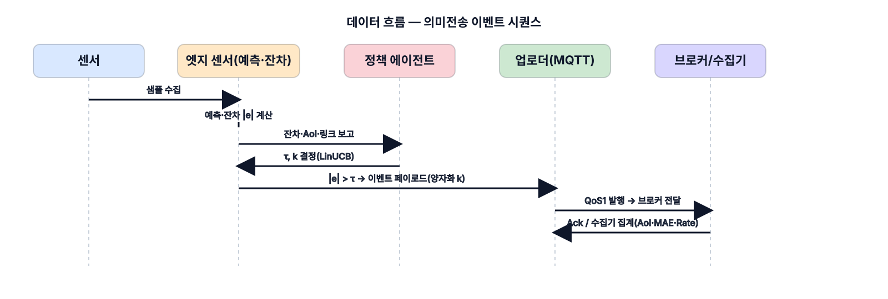
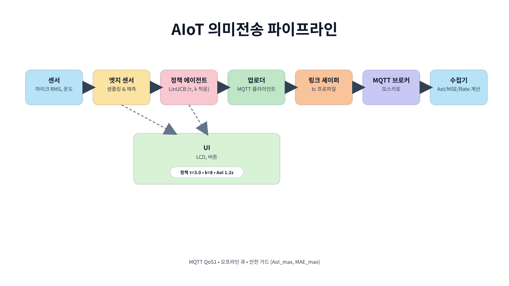

# AIoT 의미전송 통신 PoC · Raspberry Pi 5  
**AI‑Driven Semantic Uplink for Low‑Bandwidth IoT**


> **KR** · 저속·불안정 링크(LoRa 급 제약)에서 **필요한 순간·필요한 정보만** 보내도록, 엣지가 전송 정책(**임계값 τ**, **양자화 k**)을 스스로 조절하는 **의미전송(Semantic Uplink)** 실험 플랫폼입니다.  
> **EN** · A Raspberry Pi 5 semantic uplink that adapts **threshold (τ)** and **quantization (k)** to send **only information that matters** on constrained links, proving superiority over periodic sampling.

---

## 목차 · Table of Contents
- [개요 · Overview](#개요--overview)
- [산출물 · Deliverables](#산출물--deliverables)
- [아키텍처 · Architecture](#아키텍처--architecture)
- [데이터 흐름 · Data Flow](#데이터-흐름--data-flow)
- [정책 상태도(LinUCB) · Policy (LinUCB)](#정책-상태도linucb--policy-linucb)
- [핵심 지표 · Key Metrics](#핵심-지표--key-metrics)
- [빠른 시작 · Quick Start](#빠른-시작--quick-start)
- [실행 순서 · Run Order](#실행-순서--run-order)
- [설정 · Configuration](#설정--configuration)
- [데이터 모델 · Data Model](#데이터-모델--data-model)
- [폴더 구조 · Repository Layout](#폴더-구조--repository-layout)
- [로드맵(7주) · 7‑week Roadmap](#로드맵7주--7week-roadmap)
- [품질 게이트 · Quality Gates](#품질-게이트--quality-gates)
- [보안 · 개인정보 · Security & Privacy](#보안--개인정보--security--privacy)
- [Codex 메뉴얼 · Codex Manual](#codex-메뉴얼--codex-manual)
- [패치 노트 · Patch Notes](#패치-노트--patch-notes)
- [기여 · Contributing](#기여--contributing)
- [라이선스 · License](#라이선스--license)
- [English Version](#english-version)
- [부록 · Appendix](#부록--appendix)

---

## 개요 · Overview
- **목적**: RPi5 실험 플랫폼으로 **의미 기반/적응형 정책이 주기 전송보다 전송량–신선도–정확도 면에서 우월함을 실험적으로 입증**합니다.  
- **문제**: 주기 전송은 저속/손실 링크에서 **불필요한 트래픽**과 **신선도 저하(AoI↑)** 를 초래합니다.  
- **아이디어**: 엣지에서 **잔차 |e| > τ**일 때만 이벤트 전송, 링크 상태에 맞춰 **양자화 kbits**를 조절. LinUCB로 (τ,k) 팔을 선택.  
- **신뢰성**: MQTT **QoS1 + Outbox(오프라인 큐) + 백오프**, DS3231 RTC 가드.  
- **목표**: 전송량 **≥ 60% 절감**, AoI **≥ 30% 개선**, MAE 증가는 **≤ 10%**.

## 산출물 · Deliverables
이 PoC가 “완료”될 때 산출해야 하는 결과물은 아래 4종입니다.

### 1) 실행 가능한 소프트웨어(엣지·수집·분석·링크 셰이퍼)
- **Edge runtime**: `python -m edge.edge_daemon` (센서 → 예측(EWMA) → 정책(PER/ETS/LinUCB) → 양자화 → MQTT 업링크)
- **Collector**: `python -m collector.collector --run-dir <dir>` (MQTT 구독 → QoS1 중복 제거 → Parquet/메타 저장)
- **Analyzer**: `python -m collector.analyze --input <logs> --out <dir>` (Rate/AoI/MAE 집계 → CSV/MD 리포트 → (옵션) Discord 알림)
- **Link shaper**: `python -m link.shaper.tc_profiles <cmd> --iface <iface> --profile <name>` (tc/netem 링크 제약 적용/해제/상태)
- **Experiment runner**: `python -m experiments.run_scenarios --help` (프로파일×모드 매트릭스 자동 실행/아티팩트 정리)

### 2) 재현 가능한 실험 설정(설정 파일 + 실행 커맨드)
- **정책 팔/가중치/가드레일**: `configs/policy.yaml` (LinUCB arms + reward/safety)
- **링크 프로파일(소스 오브 트루스)**: 현재는 `link/shaper/tc_profiles.py`에 정의(향후 YAML로 외부화 가능)
- **디바이스/센서 설정**: 현재는 `edge.edge_daemon` CLI가 소스 오브 트루스(향후 `configs/device.yaml` 로딩 지원 가능)

### 3) 실험 로그/지표/리포트(파일 산출물)
실행하면 기본적으로 아래 결과물이 생성됩니다(경로는 예시).
- **Outbox(DB)**: `artifacts/run1/outbox.sqlite` (오프라인/재전송 보장 큐)
- **Collector logs(Parquet)**: `artifacts/run1/logs/events.parquet`, `decisions.parquet`, `markers.parquet`
- **Collector meta(JSON)**: `artifacts/run1/logs/collector_meta.json`
- **Analysis outputs**
  - `results/run1/metrics_summary.csv` (profile×policy×sensor 평균/표준편차 요약)
  - `results/run1/metrics_by_run.csv` (run 단위 지표; 리플리케이트/분산 확인용)
  - `results/run1/metrics_vs_periodic.csv` (baseline 대비 변화량/개선율)
  - `results/run1/report.md` (표 + baseline 비교 + (옵션) figures 임베드)
  - (옵션) `results/run1/figures/*.png` (막대/파레토/논문용 `paper_*.png`; `matplotlib` 설치 시 생성)
  - (옵션) `--save-parquet` → `metrics_summary.parquet`

### 4) 최종 평가 리포트(권장: 논문/발표/데모용)
아래가 “성과물”로서 가장 설득력이 높습니다.
- 링크 프로파일별/정책별 **Rate·AoI·MAE** 테이블(권장: `mean±std`, 보조로 p95)
- Periodic 대비 Fixed/Adaptive의 **변화량(Δ)** + **개선율(%)** 요약(`metrics_vs_periodic.csv`)
- Rate–AoI **Pareto / trade-off** 시각화(`figures/pareto_*.png`) + 해석
- 재현 커맨드/설정/커밋 해시(실험 재현성) + 리플리케이트 수(`n_runs`)

## 하드웨어 베이스라인
- **Controller**: Raspberry Pi 5 (8GB), Python 3.10+ (권장 3.11)
- **Sensors**: DS18B20 온도(1 Hz), USB Mic RMS(16 kHz → 100 ms 프레임)
- **UI**: 1602 I2C LCD(PCF8574, addr 0x27) + 버튼 3개(모드 17 / 프로파일 27 / 마커 22, 내부 풀업)
- **Optional**: Buzzer(BCM 18)

## 링크/정책 프로파일
- **Link**: `slow_10kbps`(10 kbps, delay 300 ms, loss 3%), `delay_loss`(100 kbps, delay 500 ms, loss 8%), `cellular_var`(50↔200 kbps 토글)
- **Policies**
  - `PERIODIC` (CLI: `--mode periodic`): 모든 샘플 전송 (대역 상한선 기준선)
  - `FIXED_TAU` (CLI: `--mode fixed_tau`, ETS): EWMA 예측 + 잔차 |e|>τ 이벤트 트리거
  - `ADAPTIVE` (CLI: `--mode adaptive`, LinUCB): 컨텍스트(AoI, residual, residual variance, outbox 큐) 기반 (τ,kbits) 팔 선택 + 안전가드

> We reduce traffic without sacrificing usefulness by sending **only deviations that matter**, while keeping **freshness (AoI)** high and **error (MAE)** bounded.

---

## 아키텍처 · Architecture
> 센서 → 엣지(예측·정책) → 업로더(MQTT) → **링크 제약(tc)** → 브로커 → 수집/평가

<p align="center">
  
</p>

**구성요소**
- **Sensors**: 마이크 RMS, 온도  
- **Edge**: 예측기(EWMA/AR1) → 잔차 → 정책(LinUCB) → 양자화 → 업로더  
- **Shaper**: `tc/netem/tbf`로 10 kbps·지연·손실 등 가혹한 링크를 에뮬  
- **Broker/Collector**: Mosquitto, 수집/복원, AoI·MAE·Rate 계산  
- **UI**: LCD/버튼으로 정책·지표 확인 및 간단 제어

---

## 데이터 흐름 · Data Flow
> |e| > τ일 때만 **이벤트** 전송. 브로커 **Ack** 후 Outbox 정리.

<p align="center">
  
</p>

1) **Sampling** → 2) **Predict & Residual** → 3) **Policy(τ,k)** → 4) **Quantize** → 5) **MQTT QoS1**  
오프라인 시 **Outbox 큐**에 보관, 재연결 시 백오프로 **안전 재전송**.

---

## 정책 상태도(LinUCB) · Policy (LinUCB)
> 컨텍스트 밴딧으로 (τ, k) 조합 선택 · **가드레일(AoI_max, MAE_max)** 보장

<p align="center">
  
</p>

- **Observe → Explore/Exploit** 루프, 보상 r = −(α·AoI + β·MAE + γ·Rate)  
- **Guardrail** 위반 시 즉시 보수 정책(τ↓ 또는 k↑)으로 전환

---

## 핵심 지표 · Key Metrics
- **Rate**: 브로커 수신 **바이트/초** (Network usage)  
- **AoI (Age of Information)**: 수신자가 들고 있는 **최신 정보의 나이**  
- **MAE**: 복원값 vs. 원본 평균 절대 오차  
🎯 **목표**: **Rate↓** 크게, **AoI↓** 의미 있게, **MAE↑**는 허용 임계 내

---

## 빠른 시작 · Quick Start

```bash
# OS & 필수 패키지
sudo apt update && sudo apt full-upgrade -y
sudo apt install -y mosquitto mosquitto-clients iproute2 python3-venv python3-dev build-essential libportaudio2

# 파이썬 가상환경
python3 -m venv .venv && source .venv/bin/activate
pip install -r requirements.txt

# 브로커 실행(개발용)
sudo systemctl enable mosquitto && sudo systemctl start mosquitto
```

---

## 실행 순서 · Run Order

```bash
# 0) (선택) 링크 프로파일 적용 (root 필요)
# - 개발 중에는 host 네트워크를 망가뜨리지 않도록 loopback(lo) 권장
sudo python -m link.shaper.tc_profiles apply --iface lo --profile slow_10kbps

# 1) 수집기(브로커 구독 → Parquet 적재/메타 저장)
python -m collector.collector --run-dir artifacts/run1

# 2) 엣지 (최소 1개 센서 enable 필요)
# - 하드웨어 없는 개발 PC에서는 temp mock만 켜도 전체 파이프라인을 검증할 수 있습니다.
python -m edge.edge_daemon \
  --device-id dev1 --profile slow_10kbps \
  --mode periodic \
  --temp-enable --temp-backend mock \
  --ui-enable --ui-kind console

# 3) 결과 집계/리포트
python -m collector.analyze --input artifacts/run1/logs --out results/run1
```

---

## 설정 · Configuration
실험 파라미터를 코드에서 분리해 “재현 가능한 실행”을 목표로 합니다.
- `configs/policy.yaml` (**사용됨**): LinUCB arms / reward / safety
- `configs/device.yaml` (**템플릿**): 센서·UI·MQTT 기본값(현재는 미적용; `edge.edge_daemon` CLI가 소스 오브 트루스)
- `configs/link_profiles.yaml` (**템플릿**): 링크 제약 프로파일(현재는 미적용; `link/shaper/tc_profiles.py`가 소스 오브 트루스)

**`configs/device.yaml`**
```yaml
device_id: rpi5a
sensors:
  mic:  { frame_ms: 100, samplerate: 16000, normalize: true }
  temp: { period_hz: 1 }
ui:    { enabled: true, backend: "lcd" }  # lcd | console
mqtt:  { host: localhost, port: 1883, base_topic: "edge" }
```

**`configs/policy.yaml`**
```yaml
arms:
  - { tau: 1.5, kbits: 6 }
  - { tau: 3.0, kbits: 8 }
  - { tau: 6.0, kbits: 10 }
reward:  { alpha: 1.0, beta: 1.0, gamma: 0.5 }  # AoI, MAE, Rate 가중
safety:  { aoi_max_ms: 5000, mae_max: 2.0 }
```

**`edge/edge_daemon.py` DS3231 RTC 가드**

네트워크가 끊겨도 타임스탬프 정확도를 유지하려면 부팅 직후 RTC→시스템 클럭 동기화를 수행합니다.

```bash
python -m edge.edge_daemon \
  --device-id rpi5a \
  --profile slow_10kbps \
  --mic-enable --temp-enable \
  --rtc-enable --rtc-bus 1 --rtc-address 0x68 \
  --rtc-drift-guard 2.0 --rtc-resync 600
```

- `--rtc-enable`: DS3231 가드 활성화 (I²C 버스/주소 지정)
- `--rtc-drift-guard`: RTC와 시스템 시간 차이가 해당 초를 넘으면 즉시 재동기화
- `--rtc-resync`: 주기적 재확인(초). `<=0`이면 부팅 시 1회만 수행
- `--rtc-push-system`: NTP 등으로 시스템 시간이 앞서면 RTC에 다시 기록 (기본 False)

RTC는 정확한 이벤트 타임스탬프를 제공해 AoI·지연 측정의 신뢰도를 높여 줍니다.

**`configs/link_profiles.yaml`**
```yaml
profiles:
  slow_10kbps: { tbf: "tbf rate 10kbit burst 4kbit limit 4k",  netem: "netem delay 300ms loss 3%" }
  delay_loss:  { tbf: "tbf rate 100kbit burst 16kbit limit 32k", netem: "netem delay 500ms loss 8% reorder 10%" }
  cellular_var:{ tbf: "tbf rate 200kbit burst 32kbit limit 64k", netem: "netem delay 120ms loss 2%" }
```

---

## 데이터 모델 · Data Model

**Event (예시)**
```json
{
  "ts": "2025-11-03T10:21:34.512Z",
  "seq": 10231,
  "device_id": "rpi5a",
  "sensor": "mic",
  "val": -42.1,
  "pred": -43.3,
  "res": 1.2,
  "tau": 3.0,
  "kbits": 8,
  "aoi_ms": 1200,
  "profile": "slow_10kbps",
  "policy": "linucb#5"
}
```

**PolicyDecision (예시)**
```json
{
  "ts": "2025-11-03T10:21:34.480Z",
  "device_id": "rpi5a",
  "state_aoi": 1.2,
  "state_res": 1.2,
  "state_res_var": 0.6,
  "state_loss": 0.03,
  "state_q_len": 5,
  "tau": 3.0,
  "kbits": 8,
  "reward": -1.42
}
```

---

## 폴더 구조 · Repository Layout
```text
.
├── common/
│   ├── discord_webhook.py     # Discord 웹훅 클라이언트 & 메시지 포맷터
│   ├── metrics.py             # AoI·MAE·전송량 계산 유틸
│   ├── mqttutil.py            # MQTT QoS1 업로드 & Outbox 헬퍼
│   ├── quantize.py            # 센서 값 양자화/복원 도구
│   └── schema.py              # 이벤트/정책 Pydantic 스키마
├── edge/
│   ├── edge_daemon.py         # 센서→정책→업로더 제어 메인 엔트리포인트
│   ├── sensors/               # 마이크 RMS·온도 센서 파이프라인
│   ├── predict/               # EWMA/AR(1) 등 예측기 구현
│   ├── policy/                # 고정τ·LinUCB 정책 로직
│   ├── uploader/              # MQTT 업로더·재전송 Outbox
│   └── ui/                    # LCD·콘솔 UI 어댑터
├── collector/
│   ├── collector.py           # 브로커 구독·수집·저장 루프
│   ├── analyze.py             # 지표 분석 CLI & Discord 알림 옵션
│   └── store_sqlite.py        # 경량 SQLite 스토리지 백엔드
├── link/
│   └── shaper/
│       └── tc_profiles.py     # tc/netem 링크 제약 프로파일 적용기
├── experiments/
│   └── run_scenarios.py       # 시나리오 일괄 실행 스크립트
├── scripts/
│   ├── apply_profile.sh       # tc 프로파일 CLI 래퍼
│   ├── start_collector.sh     # 수집기 실행 스크립트
│   └── start_edge.sh          # 엣지 데몬 실행 스크립트
├── tests/
│   ├── integration/
│   │   └── test_end_to_end_placeholder.py  # 엔드투엔드 자리표시자
│   └── unit/
│       ├── test_discord_webhook.py         # Discord 웹훅 단위 테스트
│       ├── test_linucb.py                  # LinUCB 정책 검증
│       ├── test_outbox.py                  # MQTT Outbox 신뢰성 테스트
│       └── test_quantize.py                # 양자화 정확도 테스트
├── configs/                   # 디바이스·정책·링크 YAML 설정
├── docs/
│   └── figma/                 # 아키텍처/시퀀스 다이어그램 자산
├── infra/
│   └── mosquitto/             # 브로커 설정 템플릿
├── models/                    # (추후 확장용) ML 모델 아티팩트
├── data/, logs/               # 실험 결과 & 런타임 로그 출력
└── requirements.txt, pyproject.toml 등 프로젝트 메타데이터
```

---

## 로드맵(7주) · 7‑week Roadmap
- **W1**: 지표·프로파일 동결 / 수집기 파이프 완료  
- **W2**: 기준선(주기 전송) 수집 / AoI·MAE·Rate 대시보드  
- **W3**: 고정 **τ** ETS / 1차 리포트  
- **W4–W5**: **LinUCB** 구현·튜닝 / 안전가드 검증  
- **W6**: 반복 실험 / 파레토 곡선  
- **W7**: UI 통합 / 최종 보고·데모

---

## 품질 게이트 · Quality Gates
- [ ] **토픽/스키마** 필수 필드 누락 0  
- [ ] **QoS1 중복** 수신 처리(SEQ de‑dup)  
- [ ] **Outbox** 오프라인→복구 유실 0  
- [ ] **프로파일 3종 × 모드 3종 × 반복 ≥ 3회** (권장: `experiments.run_scenarios --repeats 3`)  
- [ ] **지표(정량)**: `metrics_summary.csv`의 `mean±std` + `metrics_vs_periodic.csv` 개선율(%)  
- [ ] **지표(항목)**: Rate(B/s), AoI(mean/p95), MAE(mean/p95), k̄(kbits_mean), n_runs/n_events  
- [ ] **시각화**: `figures/`의 bar + pareto 이미지(보고서/논문에 바로 삽입 가능)  
- [ ] README/다이어그램/스크립트 동기화

---

## 보안 · 개인정보 · Security & Privacy
- **Transport**: TLS(옵션), 인증(계정·토큰) 권장  
- **MQTT**: QoS1/지속세션/Retain 조합 시 **중복 가능성** 고려  
- **Audio**: **원음 미보관·미전송**, **RMS 통계**만 사용  
- **Data at Rest**: 로컬 Outbox/로그 암호화(선택), 접근권한 최소화

## Codex 메뉴얼 · Codex Manual
Codex(또는 다른 에이전트형 도구)로 이 저장소를 열었을 때 “무엇을 어디서부터 보면 되는지” 바로 알 수 있도록 별도 문서를 제공합니다.
- `CODEX.md`: 레포 구조, 실행 커맨드, 디버깅 포인트, 체크리스트(가장 먼저 읽기)

## 패치 노트 · Patch Notes
- `PATCH_NOTES.md`: 변경 이력(문서/코드/CI), 알려진 제약, 다음 작업, 재개 지점

---

## 기여 · Contributing
```bash
pip install -e .[dev]
ruff check . && pytest -q
```
- 브랜치: `feat/*`, `fix/*`, `chore/*`  
- 커밋: `type(scope): subject` (예: `feat(edge): add AR(1) predictor`)

---

## 라이선스 · License
TBD (추후 지정)

---

# English Version

## Overview
- **Problem** · Periodic transmissions waste bandwidth on low/unstable links and degrade **freshness (AoI)**.  
- **Idea** · At the edge, transmit an **event** only when the **residual** |e| exceeds a **threshold τ**, and adapt **quantization bits k** to link conditions.  
- **Reliability** · Combine **MQTT QoS1**, **Outbox (offline queue)**, and **backoff** to handle disconnections and duplicates.  
- **Goal** · **≥ 60%** traffic reduction, **≥ 30%** AoI improvement, **≤ 10%** MAE penalty.

## Architecture
<p align="center">
  
</p>

## Data Flow
<p align="center">
  
</p>

## Policy (LinUCB)
<p align="center">
  
</p>

### Semantic Policies (실험 축)
- **Periodic**: 모든 샘플 전송 — 대역 상한선·AoI 하한선 기준선
- **Fixed τ (ETS)**: EWMA 잔차 |e|>τ일 때만 이벤트 전송 (센서별 τ·kbits)
- **Adaptive (LinUCB)**: 컨텍스트 밴딧으로 (τ,kbits) 팔 선택, 안전가드(AoI_max, MAE_max) 포함

## Key Metrics
- **Rate** (bytes/sec at broker), **AoI**, **MAE**  
**Target**: **Rate↓**, **AoI↓**, **MAE↑** bounded

## Quick Start (RPi5)
```bash
sudo apt update && sudo apt full-upgrade -y
sudo apt install -y mosquitto mosquitto-clients iproute2 python3-venv python3-dev build-essential libportaudio2
python3 -m venv .venv && source .venv/bin/activate
pip install -r requirements.txt
sudo systemctl enable mosquitto && sudo systemctl start mosquitto
```

## Run Order (1 회 실험)
```bash
# 0) 링크 프로파일 적용 (root 필요)
sudo python -m link.shaper.tc_profiles apply --iface eth0 --profile slow_10kbps

# 1) 수집기(브로커 구독 → Parquet 적재)
python -m collector.collector --run-dir artifacts/run1

# 2) 엣지 실행 (모드별)
## 주기 전송
python -m edge.edge_daemon --device-id rpi5a --profile slow_10kbps \
  --mode periodic --mic-enable --temp-enable --ui-enable --buttons-enable

## 고정 임계 ETS
python -m edge.edge_daemon --device-id rpi5a --profile slow_10kbps \
  --mode fixed_tau --mic-tau 3.0 --temp-tau 0.2 \
  --mic-enable --temp-enable --ui-enable --buttons-enable

## LinUCB 적응
python -m edge.edge_daemon --device-id rpi5a --profile slow_10kbps \
  --mode adaptive --arms configs/policy.yaml \
  --mic-enable --temp-enable --ui-enable --buttons-enable

# 3) 분석 (AoI/MAE/Rate 집계)
python -m collector.analyze --input artifacts/run1/logs --out results/run1
```

### LCD/OLED + 버튼 (현장 제어)
- 1602 LCD: `--ui-enable --ui-kind lcd1602 --ui-address 0x27`  
  16x2 포맷: `MODE/PROFILE`, `Rate(kbps)`, `AoI(ms)`, `MAE`, 링크/큐 상태
- 버튼(BCM): 모드(17), 프로파일(27), 마커(22). `--buttons-enable`로 활성화.
  - 버튼1: 정책 모드 순환 (PER→ETS→LINUCB)
  - 버튼2: 링크 프로파일 순환 (SLOW_10K→DELAY_LOSS→CELLULAR_VAR), `--tc-apply-on-button` 시 즉시 tc 적용
  - 버튼3: 마커 전송(`marker/<device_id>`) → collector `markers.parquet`에 기록
- 0.96\" SSD1306: `--ui-kind ssd1306 --ui-address 0x3C` (추가 의존: `pip install luma.oled pillow`)

## Configuration
Current status:
- `configs/policy.yaml`: **used at runtime** for adaptive(LinUCB) arms/reward/safety.
- `configs/device.yaml`: **template only** (not loaded yet; source-of-truth is `edge.edge_daemon` CLI).
- `configs/link_profiles.yaml`: **template only** (profiles are currently defined in `link/shaper/tc_profiles.py`).

## Repository Layout
```text
.
├── common/ — shared helpers (Discord webhook, metrics, MQTT outbox, quantizers)
├── edge/ — sensor ingestion, predictors, policies, uploader, and UIs
├── collector/ — MQTT subscriber, analytics CLI, and storage adapters
├── link/shaper/ — tc/netem profile orchestration utilities
├── experiments/ — batch scenario runner for reproducible studies
├── scripts/ — convenience launchers for edge/collector/link shaping
├── tests/ — unit & integration coverage for policies, quantization, webhooks, etc.
├── configs/ — reproducible YAML profiles for devices, policies, and link shapes
├── docs/figma/ — architecture and sequence diagrams embedded in this README
├── docs/hardware.md — RPi5 wiring (LCD/buttons/buzzer/DS18B20)
├── infra/mosquitto/ — broker configuration templates
├── models/ — (reserved) ML artefacts and checkpoints
├── data/, logs/ — experiment outputs and runtime diagnostics
└── requirements.txt, pyproject.toml — Python dependencies & packaging metadata
```

### Collector Outputs
- `logs/events.parquet` — deduped sensor events (seq-based)
- `logs/decisions.parquet` — policy decisions/rewards (adaptive)
- `logs/markers.parquet` — button/marker events for timeline alignment
- `collector_meta.json` — bytes, duplicates, counts for the run

## 7‑week Roadmap
- W1: Metrics/profiles freeze; collector pipeline  
- W2: Baseline (periodic) & dashboard  
- W3: Fixed‑τ ETS; report v1  
- W4–W5: LinUCB & guardrail tests  
- W6: Repeats & Pareto  
- W7: UI integration & demo

## Quality Gates
- Topic/schema validations; QoS1 de‑dup; outbox recovery (0 loss)  
- 3 profiles × 3 modes × ≥3 repeats; analyze `mean±std` + baseline deltas/improvement  
- `metrics_summary.csv` / `metrics_by_run.csv` / `metrics_vs_periodic.csv` / `figures/` for paper‑ready tables & plots  
- Pareto chart & table; README/diagrams/scripts in sync

## Contributing
```bash
pip install -e .[dev]
ruff check . && pytest -q
```

## License
TBD

---

## 부록 · Appendix
- **Pipeline Diagram (Optional)**  
  <p align="center">
    
  </p>
